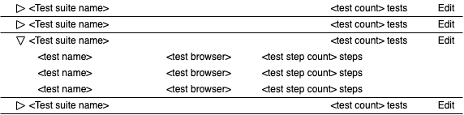

# Rainforest Frontend Homework

At Rainforest our front-end applications often exchange JSON data with various RESTful APIs. In
this homework we provide a sample API with a single endpoint and ask you to create a UI to display and edit test suite plans.

## Test suites API
You'll be provided with a `/test_suites` API endpoint (accessible from `localhost:3456`) that returns a JSON array of items in the following format:

```json
[
  {
    "id": 1,
    "test_suite_name": "Smoke suite",
    "test_plans": [
      {
        "test_name": "Login test",
        "browser": "chrome",
        "instruction_count": 3
      },
      {
        "test_name": "Reset Password",
        "browser": "firefox",
        "instruction_count": 10
      }
    ]
  },
  {
    "id": 2,
    "test_suite_name": "Full Regression Suite",
    "test_plans": [
      {
        "test_name": "Add to cart",
        "browser": "edge",
        "instruction_count": 15
      }
    ]
  }
]
```

Each item returned from the `/test_suites` endpoint will have the following:

- **id**: A unique integer
- **test_suite_name**: A string
- **test_plans**: An array of json objects with the following format:
  - **test_name**: A string
  - **browser**: One of `"chrome"`, `"firefox"`, `"safari"`, or `"edge"`
  - **instruction_count**: A number

## Task

**The focus here is on the quality of your JavaScript, not the beauty of your design. We will be paying attention to your code design, organization and testing. The controls you add should be usable but need not be much to look at.**

**You can use any UI frameworks of your choosing (or none). There is a tiny amount of react boilerplate code provided but you are free to delete it.**

Write a single page application that retrieves and displays the list of test suite plans. The application should show the test suite name and number of test plans contained within it. Each test suite can then be expanded to show its' test plans' name, browser and instruction count. Here's a mockup of the application:



Clicking on "edit" next to a test suite should bring up an interface for the user to edit the selected test suite's name and test plans:
- The user should be able to change the test suite name.
- The user should be able to add or remove any test plans.
- The user should be able to edit any of the test plan's fields.
- There should be a submit button to save the edited test plan.

For each editable field you are free to choose the appropriate input type (dropdown, text input, radio, etc.).

On submission, print the serialized JSON into the console.

After submission, the user should be able to return to the main list and edit other test plans.

Validations:
- `test_suite_name` and `test_name` should not be empty
- a test suite must contain at least one test plan
- `browser` must be one of `"chrome"`, `"firefox"`, `"safari"`, or `"edge"`
- `instruction_count` must be > 0

## Additional requirements

- Don't modify the given `public/index.html` file in any way. You're of course still allowed to modify the DOM through Javascript.
- You must use Fetch API to interact with the `test_suites` endpoint. Refer to https://developer.mozilla.org/en-US/docs/Web/API/Fetch_API for documentation.
- You may add additional libraries as you see fit (except for the fetch restriction above), but try to keep it minimal. Libraries that trivialize the solution too much would make it harder to have interesting discussions in the follow up interview, which wouldn't help your application.
- Your driver code should be written in `src/index.js`.

## Setup

**Requirements:** NodeJS >= 14, [yarn](https://yarnpkg.com/en/docs/install)

`yarn install` to install.

`yarn start` to start the development and api server

`yarn test` to run tests

The boilerplate code provided is a stripped down version of a [create-react-app](https://create-react-app.dev/) starter project.
